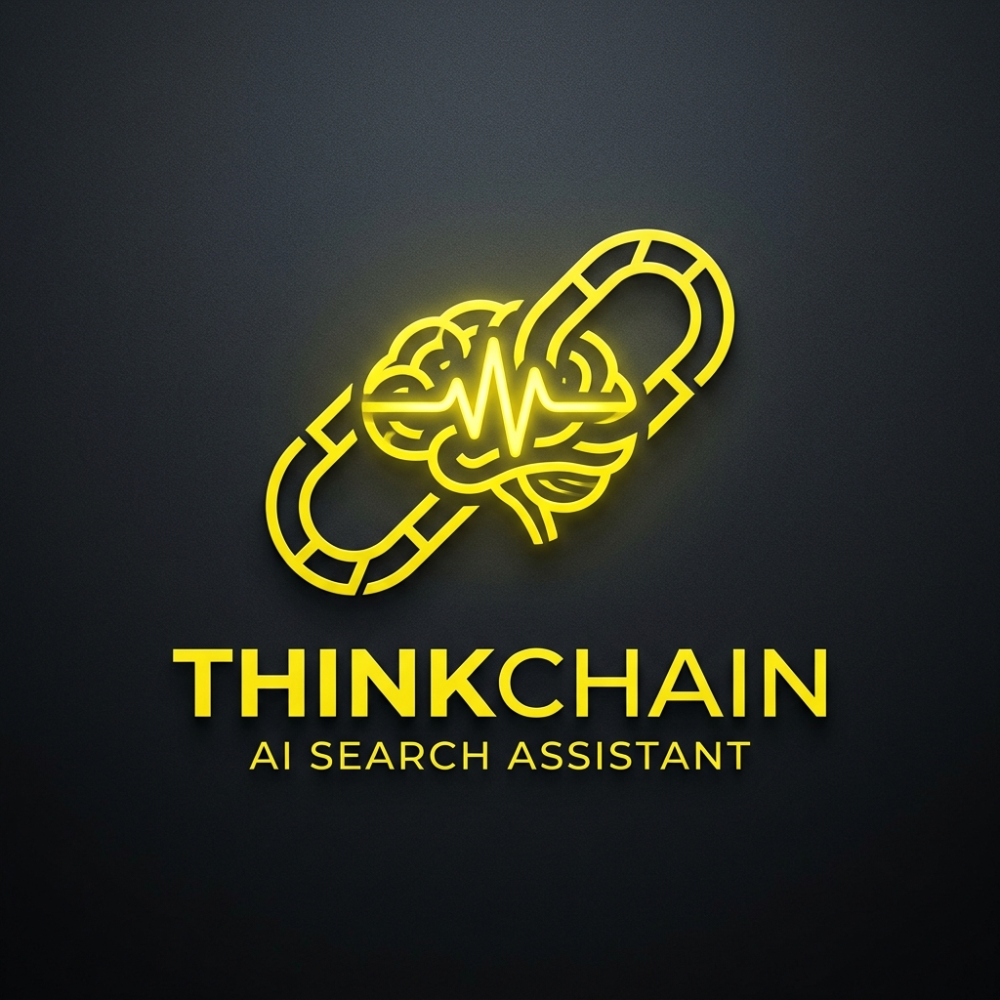
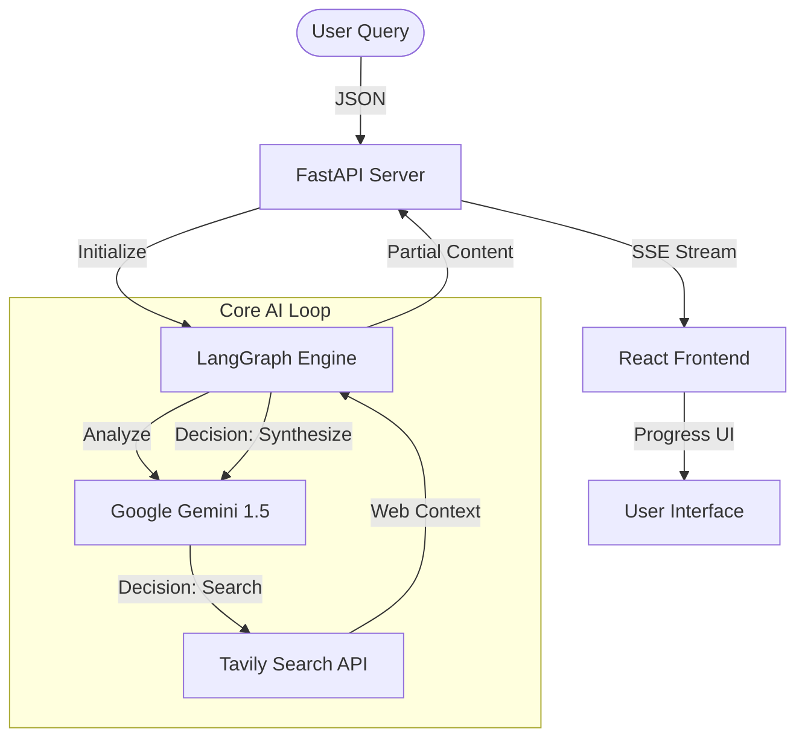

<p align="center">
  
</p>

# 🌟 ThinkChain AI v2.0: The Research-First AI Assistant

ThinkChain AI is a state-of-the-art, full-stack AI Research Assistant designed to synthesize complex information through multi-step reasoning and real-time web exploration. Unlike standard chatbots, ThinkChain AI iterates through a specialized research loop to ensure every answer is grounded in evidence and up-to-date facts.

---

## 📑 Table of Contents
- [Overview](#-overview)
- [Architecture](#-architecture)
- [Key Features](#-key-features)
- [Tech Stack](#-tech-stack)
- [Getting Started](#-getting-started)
- [Configuration](#-configuration)
- [Project Structure](#-project-structure)
- [Roadmap](#-roadmap)

---

## 📖 Overview

ThinkChain AI leverages **LangGraph** to orchestrate a "Search-then-Synthesize" workflow. It doesn't just guess; it researches. By browsing the web via **Tavily**, it gathers multiple perspectives, critiques the findings, and produces a final report formatted in high-fidelity Markdown.

---

## 🏗 Architecture

The system uses a decoupled client-server architecture. The backend manages a stateful AI graph that handles long-running research tasks, while the frontend provides a real-time, streaming interface.



---

## 🚀 Key Features

-   **✨ Onboarding Flow**: New Landing and Login pages for a professional, secure entry point.
-   **🔍 Multi-Query Research**: Generates and executes multiple distinct search queries to cover all aspects of a topic.
-   **📡 Live SSE Streaming**: Experience the AI's thought process as it unfolds, letter by letter.
-   **⏳ Progressive Timeline**: A visual timeline in the UI that tracks exactly what the AI is doing (*Searching... Reading... Writing...*).
-   **📚 Automatic Citations**: Every answer comes with a grid of source cards linking to the original articles.
-   **👤 User Profile Management**: Custom "Think Chain" identity with adaptive initials-based avatars.
-   **🎨 Premium UI/UX**: Centered "Nanobanana" yellow branding with glassmorphism effects and a hidden, slide-out sidebar.

---

## 🛠 Tech Stack

<p align="center">
  
  
  
  
  
</p>

### Backend
-   **FastAPI**: Asynchronous high-performance web framework.
-   **LangGraph**: Cyclic graph orchestration for advanced AI workflows.
-   **LangChain**: Tool-use and prompt management.
-   **Tavily Search**: Optimized search engine for LLM-based agents.

### Frontend
-   **Vite + React 19**: Ultra-fast build tool and modern component architecture.
-   **Lucide React**: Premium icon set for consistent UI language.
-   **DOMPurify + Marked**: Secure Markdown rendering for high-fidelity responses.

---

## 📂 Project Structure

```text
├── client/              # React Development Environment
│   ├── src/
│   │   ├── components/  # Modals, Landing, Login, Sidebar
│   │   ├── App.jsx      # Main orchestration & SSE logic
│   │   └── index.css    # Global design system & tokens
│   └── public/          # Assets (Logo, Icons)
├── server/              # FastAPI & LangGraph logic
│   ├── app.py           # API endpoints & Response Streaming
│   ├── system_prompt.py # Specialized AI persona & instructions
│   └── requirements.txt # Python dependencies
└── README.md            # You are here
```

---

## ⚙️ Getting Started

### 1. Requirements
Ensure you have **Node.js (v18+)** and **Python (3.10+)** installed.

### 2. Backend Setup
```bash
cd server
python -m venv .venv
.\.venv\Scripts\activate   # Windows
pip install -r requirements.txt
uvicorn app:app --reload
```

### 3. Frontend Setup
```bash
cd client
npm install
npm run dev
```

---

## 🔐 Configuration

Create a `.env` file in the `/server` directory:

```env
TAVILY_API_KEY=tvly-xxxxxxxxxxxx
GOOGLE_API_KEY=AIzaSy-xxxxxxxxxxx
```

---

## 🛣 Roadmap

- [ ] **Thread Persistence**: Save and resume research sessions.
- [ ] **File Uploads**: Research across your own PDFs and documents.
- [ ] **Dark Mode**: Native implementation for the profile-selected theme.
- [ ] **Export to PDF**: Generate research reports for offline use.

---

## 📝 License
This project is licensed under the MIT License. Produced for educational purposes in the **ThinkChain AI Research Lab**.

---

<p align="center">
  <b>Built with ❤️ by ThinkChain AI</b>
</p>
