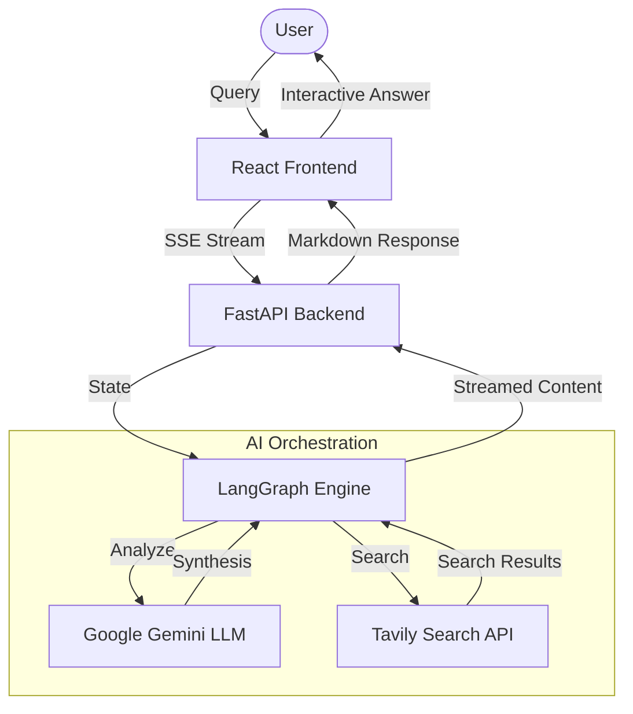

<p align="center">
  
</p>

# 🌟 Vindh AI v2.0

Vindh AI is a premium, full-stack AI Research Assistant that synthesizes complex queries into deep, evidence-based answers. Built with **LangGraph** and powered by **Google Gemini**, it performs real-time web searches using **Tavily** to provide highly accurate and cited information.

---

## 🛠 Tech Stack


### Backend
-   **Framework**: FastAPI (Python)
-   **AI Orchestration**: LangGraph, LangChain
-   **LLM**: Google Gemini (`gemini-flash-lite-latest`)
-   **Search Engine**: Tavily API

### Frontend
-   **Library**: React 19 (Vite)
-   **Icons**: Lucide React
-   **Markdown Support**: Marked, DOMPurify
-   **Styling**: Pure CSS (Modern UI)

---

## 🏗 Architecture



---

## 🚀 Features

-   **Deep Research**: Multi-step LangGraph orchestration for searching, reading, and synthesizing information.
-   **Real-time Streaming**: Instant feedback with Server-Sent Events (SSE).
-   **Progress Timeline**: Visualized AI research phases (Searching, Reading, Writing).
-   **Interactive UI**: Sleek, glassmorphism-inspired design with a dynamic slide-out sidebar.
-   **Personalized Profile**: Customizable user settings with initial-driven avatars.
-   **Mobile Responsive**: Optimized for every screen size.

---

## 📂 Project Structure

```text
├── client/          # React Frontend (Vite)
├── server/          # FastAPI Backend (Python)
│   ├── app.py       # Main LangGraph server logic
│   └── .env         # API Credentials
├── .gitignore       # Root tracking protection
└── README.md        # Project documentation
```

---

## ⚙️ Getting Started

### 1. Prerequisites
-   Python 3.10+
-   Node.js 18+
-   Tavily API Key (Get it at [tavily.com](https://tavily.com/))
-   Google Gemini API Key (Get it at [aistudio.google.com](https://aistudio.google.com/))

### 2. Backend Setup
1.  Navigate to the server directory:
    ```bash
    cd server
    ```
2.  Create and activate a virtual environment:
    ```bash
    python -m venv .venv
    # Windows
    .\.venv\Scripts\activate
    # macOS/Linux
    source .venv/bin/activate
    ```
3.  Install dependencies:
    ```bash
    pip install -r requirements.txt
    ```
4.  Create a `.env` file in the `server` folder and add:
    ```env
    TAVILY_API_KEY=your_tavily_key
    GOOGLE_API_KEY=your_gemini_key
    ```
5.  Start the FastAPI server:
    ```bash
    uvicorn app:app --reload
    ```

### 3. Frontend Setup
1.  Navigate to the client directory:
    ```bash
    cd client
    ```
2.  Install dependencies:
    ```bash
    npm install
    ```
3.  Launch the development server:
    ```bash
    npm run dev
    ```
4.  Open [http://localhost:5173](http://localhost:5173) in your browser.

---

## 📝 License
This project is created for educational and research purposes.

---

Created with ❤️ by **Vinodhan AI Research Lab**.
